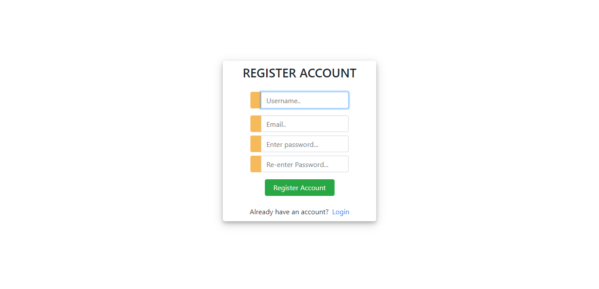
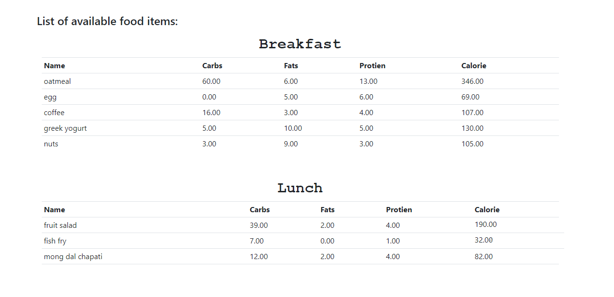
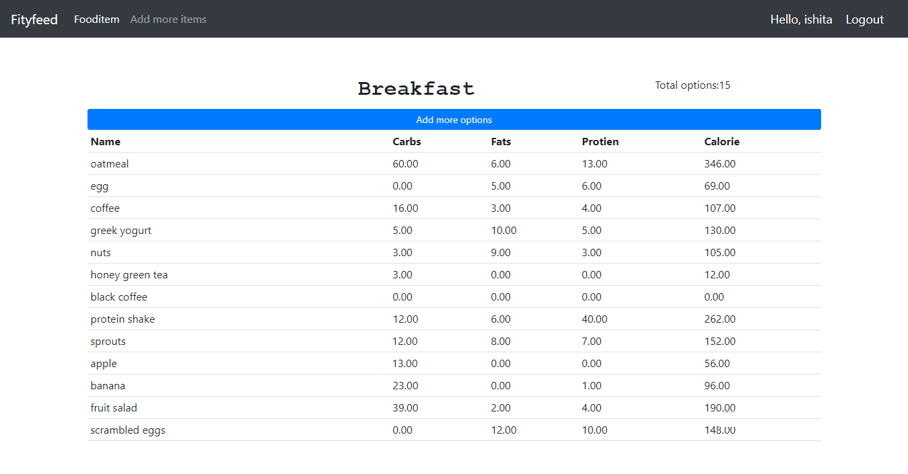
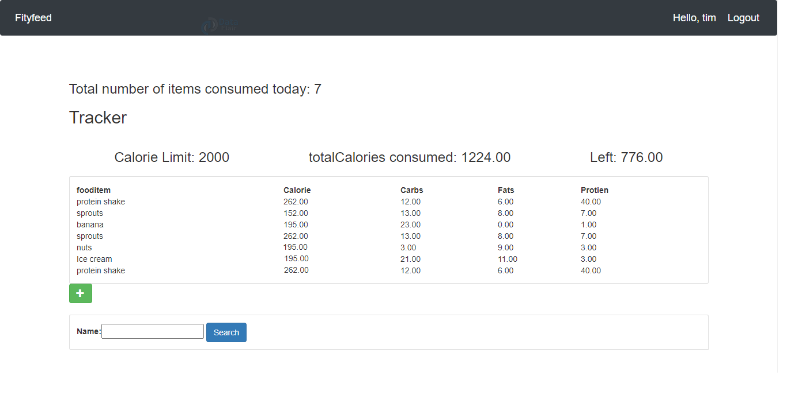

# CalorieCalculator

Calorie Calculator to record and estimate number of calories we need to consume daily. This app can also provide guidelines for gaining or losing weight.

## Project Prerequisites
To install required libraries, use pip installer from the command line.
```
pip install django
pip install django-filter
```

## Build a Python Project
```
django-admin startproject CalorieCalculator
cd  CalorieCalculator
django-admin startapp Fityfeed
```

## Migrations
```
py manage.py makemigrations
py manage.py migrate
py manage.py createsuperuser
```

## Run Server
```
python manage.py runserver
```

# Final Product







----
# 🔗 Links - Rana Ahtsham
[](https://www.linkedin.com/in/ranahtsham)
[](https://leetcode.com/ranahtsham)
[](https://github.com/ranahtsham)

